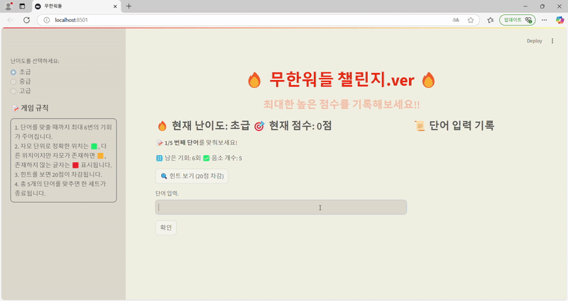

# 🔥무한워들 챌린지.ver🔥

>개발 기간 : 2024.03.07 - 2024.03.13

- 게임 설명
  - 무한워들에서 착안하여 만든 게임으로, 무한워들 챌린지 버전에서는 최대한 높은 점수를 기록하는 것이 중요합니다!
  - 기본적인 게임 룰은 무한워들과 비슷하지만, 해당 게임은 5게임이 한 세트로 이루어져있고, 시도 횟수가 적을 수록, 힌트를 보지 않을 수록 높은 점수를 기록할 수 있습니다.
  - 난이도 선택이 가능하며 난이도가 올라갈 수록 GPT가 단어에 대한 어려운 힌트를 제공합니다. 

- 게임 규칙
  1. 한 단어를 맞출 때까지 최대 6번의 기회가 주어집니다.
  2. 자모 단위로 정확한 위치는 🟩, 다른 위치이지만 자모가 존재하면 🟨, 존재하지 않는 글자는 🟥 표시됩니다.
  3. 힌트를 보면 20점이 차감됩니다.
  4. 총 5개의 단어를 맞추면 한 세트가 종료됩니다.
  

### 게임 데모 페이지
**1. 시작 화면**
   - 난이도를 선택할 수 있습니다. (힌트 제공 난이도)

**2. 게임 진행화면**
  - 난이도를 선택하면 GPT가 단어를 선정한 후 해당 단어에 대한 음소개수를 알려주며 게임을 시작할 수 있습니다.

  - 힌트를 클릭하면 20점이 차감되지만 더 빠르게 맞출 수 있습니다.
    

**4. 게임 종료 화면**
   - 300점이 최대이며 한 세트가 끝난 후 총점수를 알려줍니다.
     

